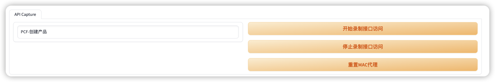

# API Testing 

## 1. 回归/录制模式

- 根据场景录制API接口测试
- 编辑API接口测试数据和代码
- 验证/运行接口测试

## 2. 接口回归/录制模式

- 运行录制程序
```sh
 poetry run qaui       
 ```
- 录制场景



- 下载场景数据

![]

- 创建Python测试脚本

![]

- 修改请求参数

- 上下文数据
- 参数数据-可变数据

- 运行测试用例

![]


