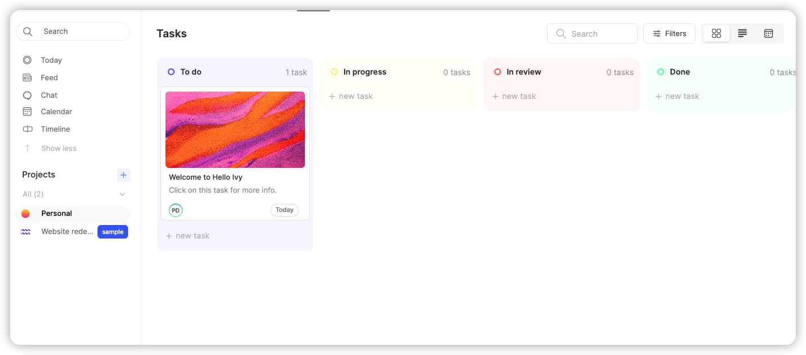

[helloivy](https://www.helloivy.co/)
>  One place for all your _projects_ and _tasks_.

## Onboard Process

1. Email User Name
2. Create Workspace for some questions

## Ivy Features

## Ivy 设计

1. 设计风格不错，可以借鉴
2. 功能比较正常，项目管理基本都可以通过多维表格进行控制，除了comments部分
3. 同时有chat功能，个人认为这个没有多大意义
4. 同开源软件plan 类似 可以参考
5. 和飞书实际上没法比