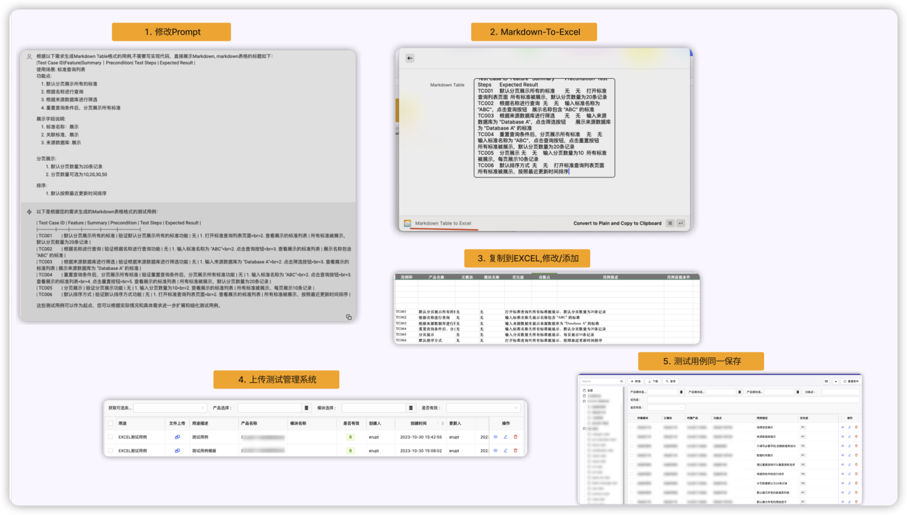

# 极简测试用例编写: AI帮你写测试用例

> 为什么他们说的那些我总是用不到？

满眼,满耳朵都是AI,chatgpt，什么LLM，什么大模型，什么替换测试，可是我为什么就是用不到呢？
看了一堆一堆的介绍，可是哪些有用呢？再看一堆一堆资料，概念，说辞，我连要看哪些都不知道了，好吗？
好吧，那我只能去报名上课了？等等......

> 不需要什么完满？只要和现在比好点就行了

要比现在好点其实说来惭愧，只要不当存粹测试用例打字员就行.

> 主要比现在好就行！

小试了一下帮忙写测试用例的情况，慢慢他变成了我的小日常. 如果使用听我慢慢道来.

## 测试用例流程

测试用例管理流程图可以画挺好看，比如:


着balabala一大堆，然后现实发现要做的事情:
1. 看需求
2. 重新抄一遍需求,然后增加一些用例, 编程脑图/Excel
3. 测试用例Review,开一个会议，然后说一个1小时，结束，关心的人其实不太多
4. 然后下次迭代重复

写多了测试用例之后，有一个打字员的感觉，不是吗？我反正有点. 虽然很多人反复强调测试用例很重要,
这是一个事实，确实很重要，但你也无法否认很很大一部分测试用例其实是类似的，有些只是换了一种形式的需求文档. 

没有任何不尊重测试用例的意思，只是说一些事实. 而我只想少打一些字，少做一些格式转化的事情.

所以我试了一下下面的方式.

## 选择什么样的测试用例让AI帮助写

这其实不用太想,就是一些最常见的功能:
1. 增删改查
2. 字段校验等等
3. 查询分页

## 怎么让AI帮忙写呢？

A. 简洁描述一下需求给AI
```
生成如下需求的测试用例: 

使用场景: 标准查询列表
功能点: 
 1. 默认分页展示所有的标准
 2. 根据名称进行查询
 3. 根据来源数据库进行筛选
 4. 重置查询条件后，分页展示所有标准
展示字段说明:
 1. 标准名称：展示
 2. 关联标准，展示
 3. 来源数据库: 展示

分页展示:
    1. 默认分页数量为20条记录
    2. 分页数量可选为10,20,30,50
排序: 
    1. 默认按照最近更新时间排序
```

B. AI回答如下


等等,这回复是挺好的，但是日常工作测试用例要编程脑图或者Excel呀，那还要再写一遍？算了我还是不用了.

## 用例格式转换成Excel

其实也就很快变成不用写什么程序，复制粘贴就可以了. 下图是我的整个过程:



完成的目的: 

1. 不求完美，只求减少一点意义不那么大的工作量
2. 使用代码部分很少，只是用了之前的极简测试用例管理系统
3. 挺顺利的，满足了自己的需求
   - 减少打字量
   - 减少格式转换量
   - 测试用例可以得到系统保存

## 参考

- [极简测试用例管理](https://testerhome.com/articles/37737)
- [大模型真的会让软件测试人员下岗吗？](https://mp.weixin.qq.com/s?__biz=MjM5ODczMDc1Mw==&mid=2651858183&idx=1&sn=ef3050bbef359d2b9095523b0a8deba2&chksm=bd22c8698a55417fc793c23b1e07e29538d2952efa98e3e837b95f09c7b76853eec5eab2d5cb&scene=178&cur_album_id=2745486739611648001#rd) 只有思考思考,然后觉得很厉害


